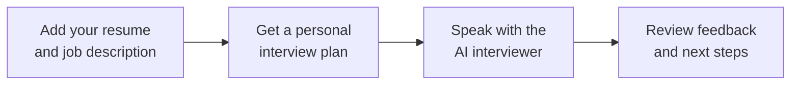

# Voice Mock Interview Agent

Practice a job interview out loud with an AI interviewer. Add your resume and the job description, have a spoken conversation, and get feedback on your answers before the real interview.

**[Try the live app](https://d26nujzw03owfm.cloudfront.net)**

## Why this project exists

Knowing a subject and explaining it in an interview are different skills. This app gives you a place to practise introducing yourself, talking about your projects, and answering questions relevant to the role you want.

The interview uses your own background and the job description to choose what to discuss. It can ask follow-up questions based on your answers.

## How it works



1. **Add your details.** Paste the job description. Upload a PDF or DOCX resume, or paste its text. Review the extracted text before continuing.
2. **Prepare the interview.** The app identifies relevant topics from your experience and the role.
3. **Start the conversation.** Click **Start voice**, allow microphone access, and answer out loud. The interview starts with your introduction, then moves into your interests, projects, and role-related questions.
4. **Review your feedback.** Click **Finish interview** to see what went well and what to practise next.

You need a microphone and an internet connection. Your microphone stays off until you start voice.

## What the feedback tells you

The feedback is based on the conversation you actually had.

| Part of the feedback | What it helps you understand |
| --- | --- |
| Interview summary | How your practice session went overall |
| Strengths | What worked well in your answers |
| Areas to improve | Where your answers need more detail or stronger examples |
| Topic feedback | How you answered in each area, with supporting evidence |
| Next steps | What to practise before your next interview |
| Practice scores | An overall score out of 100 and topic scores out of 4, when there is enough evidence |

Topics you did not answer are marked **not assessed**. A session without substantive answers is not scored. The feedback is a practice aid; it does not predict a hiring decision.

## A simple example

Suppose your resume describes a Python project and you are applying for a software role. The interviewer can ask what you built, why you made certain choices, and what you would improve. Your feedback then helps you see whether you explained your contribution clearly and supported your answers with examples.

## What powers the app

| Technology | Its role |
| --- | --- |
| Python and FastAPI | Run the app and guide the interview |
| Gemini | Help plan questions and produce feedback |
| Vapi | Handle the spoken conversation |
| Supabase Postgres | Save the conversation and feedback |
| AWS Elastic Beanstalk and CloudFront | Host the app and provide its secure web link |

Resume text and answers are processed by the services behind the app, and interview text and feedback are saved. Use sample details if you prefer not to share personal information. Refreshing the page restores the saved session in the same browser, but does not reconnect a voice call.

<details>
<summary><strong>Developer setup and tests</strong></summary>

### Run locally

You need Python 3.12, `uv`, and configured Supabase, Gemini, and Vapi accounts.

```sh
uv venv --python 3.12 .venv
uv pip install --python .venv/bin/python -r requirements.txt
cp .env.example .env
```

1. Fill in `DATABASE_URL`, `GEMINI_API_KEY`, `VAPI_PRIVATE_KEY`, and `VAPI_PUBLIC_KEY` in `.env`. Keep this file private.
2. Run `schema.sql` in the Supabase SQL Editor.
3. Start the server below and expose it through a public HTTPS tunnel. Set that HTTPS address as `PUBLIC_BASE_URL` in `.env` so Vapi can reach the app.

```sh
.venv/bin/uvicorn app.main:app --host 127.0.0.1 --port 8000
```

4. In another terminal, run `.venv/bin/python scripts/setup_vapi.py`. It configures the voice assistant and writes the required assistant IDs and callback token to `.env`.
5. Restart the app server to load those settings, keep the tunnel running, and open `http://127.0.0.1:8000`.

If the public HTTPS address changes, update `PUBLIC_BASE_URL`, rerun the setup script, and restart the server.

### Run tests

```sh
.venv/bin/python -m unittest discover -s tests -v
node tests/frontend.test.cjs
```

Database integration tests are skipped by default. Set `LIVE_DATABASE=1` to run them against a configured database; they create and remove synthetic test records.

</details>
