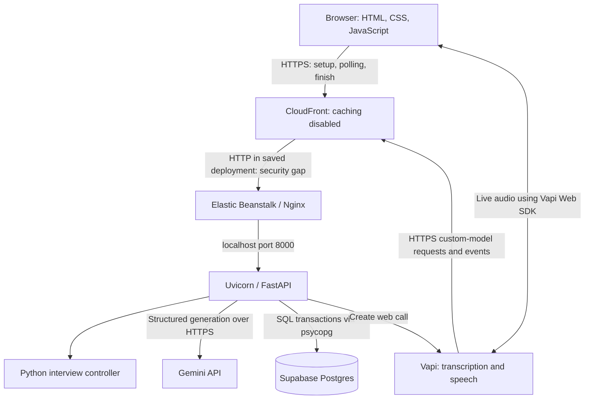

# Voice Mock Interview Agent
## Technical design, project explanation, and interview preparation

**Review date:** 25 September 2026  
**Audience:** The project owner preparing for fresher or junior software/AI engineering interviews.  
**Evidence:** Current application source, schema, setup script, tests, saved deployment configuration, and dated verification notes.  
**Status:** Deployed prototype with working integrations and known correctness, security, and operational limitations. This document does not certify production readiness or current cloud health. No cloud resources or application behavior were changed during this review.

### How to use this guide

Start with sections 1–4 to explain the project in a few minutes. Study sections 5–9 to answer technical follow-ups. Use sections 10–13 to explain bugs, tradeoffs, testing, and improvements. Finish with the interview questions and practice exercises. “Current” means implemented in the inspected source; “proposed” means future work. Keywords have three layers: plain meaning, this project's implementation, and the deeper engineering question.

**Jump to:** [Resume bullets](#1-three-resume-bullets-you-can-defend) · [Problem](#2-problem-statement-and-product-scope) · [Spoken explanation](#3-explain-the-project-aloud) · [Architecture](#4-architecture-and-ownership) · [Workflow](#5-end-to-end-workflow) · [Data and APIs](#6-state-data-model-and-api-contract) · [Technology choices](#7-technology-decisions-why-this-why-not-that) · [Keyword deep dives](#8-keywords-explained-three-levels-deep) · [Reliability stories](#9-reliability-stories-you-can-explain-deeply) · [Testing](#10-testing-and-evidence-you-may-claim) · [Performance](#11-performance-and-cost-honest-interpretation) · [Limitations](#12-limitations-and-specific-improvement-proposals) · [Roadmap](#13-roadmap-and-production-scale-design) · [Interview questions](#14-technical-interviewer-question-bank) · [Exercises](#15-practice-exercises-prove-you-understand-it) · [Sources](#16-source-map-and-further-reading)

## 1. Three resume bullets you can defend

- **Built and deployed** a voice mock interview application on AWS, integrating FastAPI, Gemini, Vapi, and Supabase Postgres to tailor questions to resumes and job descriptions and generate structured interview feedback.
- **Engineered** a stateful interview controller that combines validated model decisions with Python rules for contextual follow-ups, topic progression, repetition checks, and interview completion.
- **Implemented** transactional answer persistence and request deduplication to preserve received answers across model failures and prevent completed request retries from advancing the interview twice.

These describe implemented work without implying unmeasured user impact. There is no evidence for a large percentage improvement in hiring success, scoring accuracy, or production reliability. Do not add one. The third bullet gives you a concrete engineering story: a request can succeed on the server even when its caller never receives the response.

**What each bullet invites the interviewer to ask:**

| Bullet | Likely first question | Likely deeper question |
|---|---|---|
| Built and deployed | Walk me through one conversation turn. | Does audio travel through FastAPI? Which network hops are encrypted? |
| Engineered | What makes the interview stateful and adaptive? | What if Gemini proposes an illegal transition or irrelevant question? |
| Implemented | Why would a request arrive twice? | What if the process crashes between saving the answer and saving the next question? |

Use these bullets only when you can explain the corresponding code and tests. If asked about development tools, explain honestly how you used AI assistance, what you verified, and what you now understand and own.

## 2. Problem statement and product scope

### Problem

Candidates need practice explaining their own projects and experience for a particular job. Static question lists do not respond to what a candidate actually says. A general conversational model can lose coverage, repeatedly probe one area, jump into technical details too soon, or produce feedback without enough evidence.

### Proposed solution

A browser application accepts a resume and job description, extracts a compact interview context, starts a spoken interview, selects follow-ups based on candidate answers, preserves the conversation, and produces structured practice feedback. Python owns the progression rules; Gemini supplies language understanding and question proposals; Vapi supplies voice transport and speech services.

### Intended users and requirements

| User need | Current implementation | Important boundary |
|---|---|---|
| Practice for a specific role | Resume/JD context includes skills, responsibilities, overlaps and gaps | Extraction can omit or misinterpret information |
| Upload an existing resume | PDF/DOCX to editable text | No OCR or legacy `.doc` support |
| Begin naturally | Fixed introduction, motivation, then broad project overview | Opening answers are accepted without a semantic completeness check |
| Answer naturally by voice | Vapi Web SDK and speech pipeline | Silence detection may cut off a pause or wait too long |
| Receive relevant follow-ups | Gemini gets current context, state and recent turns | Relevance is prompt-guided, not guaranteed by Python |
| Avoid endless questioning | Topic order, depth limit, completion rules | Fixed limits still influence duration and coverage |
| Recover work after an error | Persistent transcript and committed candidate answers | Refresh does not rejoin the voice call |
| Receive useful feedback | Topic evidence, scores, strengths and recommendations | Scores are not validated hiring measurements |

### Non-goals and success criteria

Current non-goals: hiring decisions, proctored assessments, a coding execution environment, training a speech or language model, multi-user administration, and a guaranteed 20–25 minute interview.

**Functional success:** A candidate can prepare an interview, hear questions, provide answers, obtain follow-ups, finish, and retrieve stored feedback. **Reliability success:** Supported request retries do not duplicate progression; a failed model request does not erase an already committed answer. **Quality success, still to measure:** questions grounded in evidence, appropriate depth, low repetition, accurate feedback, and acceptable perceived voice delay across varied users.

## 3. Explain the project aloud

### A 45-second introduction

“I built a voice mock interview application that uses both a resume and a job description to decide what to discuss. The candidate speaks through Vapi, while FastAPI manages the interview state in Supabase Postgres. Gemini assesses an answer and proposes the next question, but Python checks whether to continue the topic, move forward, or finish. I also handled provider retries and failures so a repeated request does not consume another interview turn and an answer survives a failed model call. The app is deployed on AWS. The main remaining work is stronger turn identification, scoring validation, and production security and scaling.”

### A two-minute explanation

1. **Problem:** Explain why generic question lists do not assess an individual's project choices or role fit.
2. **Design:** Separate speech transport, model intelligence, deterministic progression and persistent storage.
3. **Example:** A candidate mentions hybrid retrieval; the model can ask why they combined keyword and vector search, subject to the controller's allowed topic and depth.
4. **Engineering challenge:** Speech transcripts differ from generated question text, and callbacks can be retried. Exact text matching caused valid answers to be rejected; request deduplication and tolerant stale-question checks address different failure modes.
5. **Evidence:** Local tests validate controller and API behavior; historical live tests exercised Supabase and the providers. Small timing samples are available, but there is no broad quality or scale benchmark.
6. **Tradeoff:** Keeping the application small made the behavior explicit, but heuristic turn matching and slow external calls inside database locks are limitations.

Do not imply that the hybrid retrieval example is a retrieval system implemented in this app. It is a possible candidate project discussed by the interviewer.

## 4. Architecture and ownership



**Audio and application requests are separate paths.** FastAPI receives text and call metadata, not the live microphone audio stream. Vapi manages browser voice transport; its configured transcription provider is Deepgram Nova-3 and its configured voice is Godfrey V2. Gemini is the only application reasoning LLM. The application did not train these provider models.

| Component | Owns | Does not own |
|---|---|---|
| Browser | Inputs, optional upload, microphone permission, call controls, rendered state | Private provider keys, authoritative interview progression |
| Vapi | Audio connection, transcription, speech synthesis, speech events | Database state, final assessment policy, permitted topic transitions |
| FastAPI | Request validation, browser ownership, provider authentication, orchestration | Speech recognition or synthesis models |
| Python controller | Opening stages, allowed transitions, depth/count checks, fallback questions | Perfect semantic relevance or proof that speech has finished |
| Gemini | Context extraction, answer assessment, question proposal, final feedback | Direct database writes or unrestricted progression authority |
| Supabase Postgres | Context, state, transcript, assessment and feedback persistence | Audio streaming; this app does not use Supabase Auth or Realtime |
| AWS | Application hosting and public HTTPS edge | Automatic end-to-end encryption merely because CloudFront is enabled |

### Deployment facts and an important correction

The recorded deployment uses one Elastic Beanstalk environment in `ap-south-2`, a Python 3.12 platform, Nginx and Uvicorn. `Procfile` binds Uvicorn to `127.0.0.1:8000`; Nginx receives external traffic. CloudFront supplies the public domain and forwards cookies, query strings and authorization while disabling caching.

The saved CloudFront configuration uses `OriginProtocolPolicy: http-only`. Consequently, browser/Vapi-to-CloudFront is HTTPS, but CloudFront-to-origin is HTTP. Private resume content, cookies and callback credentials can traverse that unencrypted hop. A Secure cookie protects the browser's sending policy; it does not encrypt a proxy's subsequent HTTP request. Earlier “HTTPS deployment” wording must not be interpreted as encryption on every hop.

**Proposed correction before production use:** provision a trusted certificate on an HTTPS origin, set the CloudFront origin policy to HTTPS-only, and restrict direct origin access. This is an actual deployment limitation, not a hypothetical concern. AWS documents the two protocol settings separately in its [custom-origin HTTPS guide](https://docs.aws.amazon.com/AmazonCloudFront/latest/DeveloperGuide/using-https-cloudfront-to-custom-origin.html).

## 5. End-to-end workflow

### 5.1 Prepare the inputs

1. The user pastes the JD and either pastes a resume or uploads a PDF/DOCX.
2. JavaScript sends raw file bytes to `/api/resume-text?kind=pdf|docx`. No multipart library is needed for this single-file endpoint.
3. The backend bounds the request body, checks the file signature and parses text. `pypdf` handles PDF; Python ZIP/XML tools handle DOCX.
4. Extracted text appears in an editable textarea so the candidate can correct ordering or omissions.
5. `/api/interviews` accepts both text fields, each between 30 and 20,000 characters after trimming.

The original file is not stored. Resume and JD text go to Gemini during analysis. The database retains the extracted structured context rather than separate original document columns. That context and the transcript still contain personal information and require retention controls.

### 5.2 Create interview context

One Gemini request returns `Context`: skills, projects, employment/internships, education, responsibilities, required/preferred skills, overlaps, gaps and topics. The JSON result must validate against Pydantic models.

The application replaces the generated first question with a fixed welcome and self-introduction. If no employment is extracted and projects exist, `plan_projects()` builds project topics before role competencies. **The inspected implementation still limits this to five projects plus two competencies.** That is a remaining implementation restriction; the user's intended principle is to finish a project and move to another relevant project, not a universal five-project format.

FastAPI inserts the interview and opening turn in one database transaction, creates/reuses a random browser ownership token, stores its SHA-256 hash, and sends the raw token in an HttpOnly cookie. The browser stores only the interview UUID in localStorage.

### 5.3 Start voice

The browser checks microphone access and calls the Vapi SDK. The SDK is directed to this application's `/voice` proxy. Its `assistantId` argument contains the interview UUID; the backend resolves the actual saved Vapi assistant ID from server configuration. This naming is SDK compatibility, not the same identifier being reused.

The backend checks ownership and `ready` status, then calls Vapi `/call/web` with the configured public integration key. It overrides the first message and attaches interview metadata. Only the call ID and web call URL are returned to the browser; the backend stores the call ID and changes status to `active`.

### 5.4 Process a candidate answer

```mermaid
sequenceDiagram
    participant User as Candidate
    participant V as Vapi
    participant A as FastAPI
    participant DB as Postgres
    participant G as Gemini
    User->>V: Spoken answer
    V->>A: Transcript history + call ID + interview ID
    A->>A: Authenticate, validate, identify duplicate or stale request
    A->>DB: Lock interview, save answer, commit
    A->>DB: Reacquire lock and reread current state
    alt Introduction or motivation
        A->>A: Python chooses fixed transition
    else Adaptive discussion
        A->>G: Context + state + allowed topics + recent turns
        G-->>A: Structured assessment and next-question proposal
        A->>A: Validate model output and apply controller rules
    end
    A->>DB: Save assessment, next question and state; commit
    A-->>V: Completion response / SSE-compatible output
    V-->>User: Synthesized question audio
```

The model request includes only the last eight stored turns, plus the complete processed context and current state. The complete transcript remains in the database. This reduces prompt size but can omit older answer details during question generation.

### 5.5 Keep the screen aligned with speech

While voice is active, the browser polls state every three seconds. It normally preserves the displayed question until an interviewer `speech-start` event allows the next stored question to appear. A refresh counter prevents an older HTTP response from replacing newer state.

This is event-gated display synchronization, not exact audio/text alignment. The backend may already have stored the next question before speech starts. A speech event also lacks an application question ID, so interruptions remain an edge case.

### 5.6 Finish and produce feedback

The controller eventually offers final additions, then returns the closing phrase. Vapi end/status events mark an active interview `ended`; they do not automatically request evaluation. The user presses Finish, which stops voice and calls `/finish`.

The endpoint marks the interview ended in a committed transaction, then requests an `Evaluation` using full stored context and transcript. It checks topic names, suppresses some unsupported scores, stores the evaluation and marks the interview `completed`. A repeat Finish request returns the saved evaluation. If generation fails, status remains ended and evaluation can be retried.

### 5.7 Refresh and interruption

A page refresh retrieves the interview using its localStorage ID and ownership cookie. The transcript and final evaluation can be restored. The existing voice room is not reconnected. An active record without a local voice instance is displayed as interrupted, and the user can finish to obtain feedback. Losing the cookie loses access even if the interview UUID remains.

## 6. State, data model and API contract

### Two kinds of state

**Lifecycle status:** `ready → active → ended → completed`. A prepared interview can also be finished directly; `ended` means conversation stopped, whereas `completed` means feedback exists.

**Conversation stage:** `introduction → motivation → discussion`, followed by `wrapping_up`. The state stores current topic, follow-up depth, question count and covered topic indexes. The current question is inferred from the latest assistant turn; it has no separate explicit question-ID field in provider messages.

### Controller rules

- During opening stages, Python supplies fixed transitions and skips Gemini assessment.
- During discussion, allowed choices are the current topic, when another probe is permitted, and the immediate next topic. Arbitrary jumping or revisiting earlier topics is not implemented.
- Consecutive normal follow-ups are limited to two. Question-budget logic reserves room for later topics where possible.
- A model decision with `answers_question=false` asks for clarification without increasing topic coverage or follow-up depth; it still consumes question count.
- Invalid action/topic combinations or similar question proposals trigger Python fallback wording.
- Early `finish` is rejected while later topics remain, except that the budget can force wrap-up.
- The configured count is 18; wrap-up and closing messages are added separately, so it is not an exact maximum of all spoken assistant messages.

**Coverage is a bookkeeping label.** It does not prove mastery, sufficient depth, or that every listed skill was assessed. Multiple clarifications can consume the budget before all topics are visited.

### Minimal schema

| Table / field | Purpose | Reason |
|---|---|---|
| `interviews.id` | Interview UUID, primary key | Stable identity |
| `owner_hash` | Hash of random browser credential | Access check without storing the raw cookie |
| `context` JSONB | Extracted resume/JD and topic plan | Nested data accessed mainly as a whole |
| `state` JSONB | Controller position and counters | Compact per-interview state |
| `status`, `call_id` | Lifecycle and unique Vapi call binding | Prevent unrelated calls modifying an interview |
| `evaluation` JSONB | One final report | No separate evaluation lifecycle yet |
| Interview timestamps | Creation/update times | Basic traceability |
| `interview_turns` | Ordered user/assistant text | Persistent conversation history |
| `(interview_id, sequence)` | Composite primary key | Unique ordered turns within a session |
| `topic`, `assessment` | Associated topic and model assessment | Evidence for later feedback |
| `request_key` | Unique hash for candidate request deduplication | Replay detection |
| Foreign key with cascade | Turns belong to an interview | Prevent orphaned turns; deletion removes its turns |

JSONB is Postgres's structured JSON storage. Normal relational keys and constraints protect identities/order; nested context remains flexible. The tradeoff is weaker database-level validation of context/state shape and harder reporting across skills. Pydantic validates those objects in application code. The schema enables RLS but defines no user policies; backend owner filtering remains essential.

### API surface

| Method and route | Caller / protection | Result |
|---|---|---|
| `GET /` | Browser, public | HTML |
| `GET /static/...` | Browser, public | JS/CSS |
| `GET /health` | Infrastructure, public | Process liveness only |
| `POST /api/resume-text?kind=pdf\|docx` | Browser, origin check and byte limits | Extracted editable text |
| `POST /api/interviews` | Browser, origin/input checks | Interview ID and opening; ownership cookie |
| `GET /api/interviews/{id}` | Browser, ownership cookie | Context, state, transcript, evaluation |
| `POST /voice/call/web` | Browser, ownership and origin | Vapi call ID and URL |
| `POST /vapi/chat/completions` | Vapi, bearer token and stored call binding | Next spoken text |
| `POST /vapi/events` | Vapi, bearer token | Acknowledgment / end-state update |
| `POST /api/interviews/{id}/finish` | Browser, ownership and origin | Generated or stored feedback |

Typical errors: 401 missing/invalid authentication, 403 wrong origin, 404 unavailable interview/call, 409 already-started session, 413 oversized upload, 415 unsupported file kind, 422 invalid input, 502 provider/output failure, 503 missing server configuration. A 502 is not necessarily an outage of FastAPI itself.

## 7. Technology decisions: why this, why not that?

These are suitability decisions, not claims that an alternative is universally worse. The strict stack was also a user requirement.

| Choice | Why it fits here | Alternative and when it would make sense |
|---|---|---|
| HTML/CSS/vanilla JS | Three screens and a small event flow; no build pipeline required | React/Vue if UI complexity and reusable interaction state justify them; explicitly excluded here |
| Python/FastAPI | Direct JSON endpoints, validation integration and familiar AI/backend ecosystem | Django for a broader account/admin product; Flask for a smaller manually assembled API |
| Pydantic | One explicit model contract for generated and stored data | Manual dictionary checks become repetitive; validation still cannot prove factual truth |
| Gemini REST through httpx | One reasoning provider, structured context/decision/evaluation calls | Another LLM would require measured quality/latency justification and violate current stack constraints |
| Vapi | Existing browser audio, speech recognition, voice and interruption integration | Direct WebRTC/STT/TTS orchestration offers control but adds a large media subsystem |
| Supabase Postgres | Managed relational storage with SQL transactions and constraints | SQLite for a purely local demo; document DB if access patterns were mainly independent documents without these transaction needs |
| psycopg SQL | Small schema and explicit locking/transaction behavior | ORM when a larger domain model and migrations make it worthwhile |
| JSONB plus two tables | One report per session and append-ordered transcript | Separate reports table if reports are versioned, reviewed, or regenerated independently |
| Python controller | Few explicit rules, easy to inspect and unit-test | LangGraph if orchestration becomes a complex graph; LangChain if numerous integrations justify it; neither needed or allowed here |
| No vector database | Resume/JD fit in bounded prompts; no large external corpus is searched | Retrieval infrastructure if adding a large vetted question bank or documentation corpus |
| No Redis/Celery | Postgres already stores state and the candidate needs the next turn immediately | A queue for longer background reports; pooling and shorter transactions should precede extra state systems |
| Polling plus speech events | Small UI update requirement, provider already gives speech events | WebSocket/SSE UI updates when polling cost or synchronization requirements warrant it |
| Elastic Beanstalk | Hosts existing Python process without containerizing it | Containers/ECS for portability or complex runtime needs; direct EC2 needs more operational ownership |
| CloudFront | Managed public HTTPS domain without initially buying/configuring a custom domain | HTTPS load balancer/custom domain; current origin encryption gap must be corrected |
| pypdf and ZIP/XML | PDF parser needed; DOCX text is readable with standard library | OCR for scanned files; richer DOCX tooling for layout/editing requirements |

### Dependency inventory

`fastapi` supplies routing, requests and responses; `pydantic` supplies typed validation; `uvicorn` runs the ASGI app; `httpx` makes provider HTTP calls and supports tests; `psycopg[binary]` connects to Postgres; `python-dotenv` loads local environment configuration and helps the Vapi setup script update it; `pypdf` extracts PDF text. The browser imports Vapi Web SDK 2.7.1 from `esm.sh`. Node is used only to run frontend regression checks, not as the production backend. Dependency ranges are bounded but not fully locked.

## 8. Keywords explained three levels deep

### 8.1 Stateful interview controller

**Level 1 — Meaning:** The interviewer remembers where the conversation is and what it has already discussed.

**Level 2 — Implementation:** A `State` object holds stage, topic index, depth, count, coverage and wrap-up flag. It lives in Postgres, not solely in a browser variable or process memory. `choose_question()` copies state and returns a question and updated state.

**Level 3 — Why it matters:** The model can propose a transition, but Python determines which transitions are legal. This makes the control rules testable even if the model changes. It is a constrained state machine, not an autonomous agent that can invoke arbitrary tools. Model-dependent wording and relevance remain probabilistic.

**Follow-up:** “Could two servers disagree?” They can read stale state, so mutations use database locking. Persistence alone does not solve concurrent updates.

### 8.2 Adaptive questioning and grounding

**Level 1:** The next question depends on the answer; grounding means tying questions to supplied evidence.

**Level 2:** Gemini sees resume/JD context, the current topic, allowed choices, recent turns and the answer. It returns both an assessment and question in one call. Example: “We used hybrid retrieval” can invite “What did keyword search catch that embeddings missed?”

**Level 3:** Relevance is not ensured merely by valid JSON. Python verifies the topic/action combination, but a sentence can still be irrelevant while carrying a valid topic index. Older answers beyond the eight-turn prompt window can be missed. Grounding needs evaluated examples and evidence checks if strong guarantees are required.

**Follow-up:** “Is this RAG?” No retrieval stage or vector index exists in the app. Supplying resume/JD context is prompt grounding. A candidate mentioning RAG does not make the interviewer itself a RAG system.

### 8.3 Structured output, JSON Schema and Pydantic

**Level 1:** Ask the model for a form with known fields instead of an arbitrary paragraph.

**Level 2:** `Decision` includes `action`, `topic`, `question`, `assessment`, `evidence`, nullable `score`, and `answers_question`. The app sends `model_json_schema()` and validates the returned JSON with `model_validate_json()`.

**Level 3:** Three checks differ: valid JSON syntax, schema-valid data, and correct business meaning. A score of 8 fails the 0–4 constraint. Topic 6 can pass the schema but be unavailable in this interview. A grammatically correct question can still be ungrounded. Controller checks complement schema validation; neither proves factual correctness. [Gemini structured output documentation](https://ai.google.dev/gemini-api/docs/structured-output).

**Follow-up:** “What happens if validation fails?” The current helper returns a generic 502; it does not silently trust the output or run an automatic repair loop.

### 8.4 Transactional persistence, commit and rollback

**Level 1:** Save related database changes together, so partial updates do not leave contradictory state.

**Level 2:** Candidate text is inserted and committed before asking Gemini. A second transaction saves the assessment, next question and new state together. If generation fails, that second transaction rolls back while the answer remains durable.

**Level 3:** One giant transaction would discard the candidate answer on model failure. Two transactions allow recovery, but introduce an interval between answer acceptance and progression. The second phase rereads state under lock to handle another request finishing or advancing the session first. This is local transaction safety, not a distributed atomic transaction across Vapi, Gemini and Postgres.

**Follow-up:** “What if the process dies after committing the next question but before replying?” The caller can retry; the stored response is reused when the deduplication key matches.

### 8.5 Idempotency and request deduplication

**Level 1:** Repeating the same operation should not create another effect.

**Level 2:** The app hashes the call ID and cumulative user-message contents. If that request already has an answer turn followed by an assistant turn, it returns the existing response instead of generating another question.

**Level 3:** Hashing only the last answer would reject a legitimate later “I don't know.” Including cumulative history distinguishes many later turns from retries. However, revised/truncated provider histories can change the hash for logically equivalent input. This is not universal exactly-once processing. A provider event ID and explicit question/answer version would offer a stronger identity contract.

**Follow-up:** “Why SHA-256?” Here it is a compact deterministic fingerprint. It is not encryption. The more important correctness issue is choosing the right input identity, not the tiny collision probability.

### 8.6 Concurrency and row locks

**Level 1:** Two requests can try to change the same interview at once.

**Level 2:** `SELECT ... FOR UPDATE` serializes conflicting changes to that interview row. Unique turn-sequence and request-key constraints are additional guards. Different interviews need not share that row lock.

**Level 3:** The adaptive request holds the second row lock during Gemini generation. That simplifies consistency but can make Finish or another callback wait for a slow model. A future design can read a state version, release the lock, generate, then commit only if the version still matches. It needs explicit handling for stale results, retries and cancellation. [Postgres locking reference](https://www.postgresql.org/docs/current/explicit-locking.html).

**Follow-up:** “Would async remove lock contention?” No. Async changes how a process waits; it does not change which database rows remain locked.

### 8.7 Transcript matching and repetition detection

**Level 1:** The system tries to distinguish an answer to an old question from an answer to the pending one, and avoids asking nearly identical questions again.

**Level 2:** `stale_question()` uses `SequenceMatcher` on normalized word sequences. It rejects only a strong match to an older question: at least 0.65 similarity and more than 0.1 above the latest-question score. `repeated()` compares word-set overlap with a threshold of 0.8.

**Level 3:** These are different problems. Stale matching concerns answer attribution; repetition checking concerns generated question similarity. Word-set overlap is intersection size divided by union size, often called Jaccard similarity. It ignores word order and meaning. Semantically equivalent wording with different words can pass; similar words with different meaning can be rejected. A spoken question is an imperfect proxy for identity.

**Follow-up:** “Why did the opening repeat?” Historical logs showed small speech-transcript changes triggering the previous exact-equality check. The revised guard avoids claiming every textual mismatch is stale. It still cannot guarantee perfect attribution.

### 8.8 WebRTC, transcription and text-to-speech

**Level 1:** Audio travels from the microphone to a speech service; the reply is turned back into audio.

**Level 2:** Vapi's browser SDK establishes the voice session. Deepgram transcribes speech; the backend returns text; Vapi's configured voice speaks it. Browser speech-start/end events update the UI.

**Level 3:** WebRTC is designed for interactive media; device permissions, network connectivity and audio timing matter independently of REST endpoint correctness. FastAPI receiving a valid transcript does not prove the candidate heard the question. A successful `/call/web` response proves call setup, not that microphone audio flowed.

**Follow-up:** “What did you build versus buy?” The application builds interview state, grounding, progression and feedback orchestration. Providers supply speech and language models.

### 8.9 Endpointing, interruption and latency

**Level 1:** Endpointing is deciding when someone has finished speaking. A pause might be thinking time, not the end of an answer.

**Level 2:** The saved setup uses 2.5-second punctuation/number pauses, 3 seconds for incomplete text and 0.3 seconds of playback wait. Those are configured thresholds, not measured complete response latency.

**Level 3:** Perceived delay includes endpoint detection, provider/network transit, database work, model generation, speech synthesis and playback buffering. Reducing silence thresholds can make replies feel faster but cause the exact cutoff bug previously reported. Define the measurement start/end points before promising an improvement.

**Follow-up:** “How would you measure it?” Record candidate speech end, transcript finalization, callback arrival, model start/end, response emission and first audible interviewer speech. Compare many matched samples, report median/p95, and monitor cutoff rate alongside latency.

### 8.10 SSE and streaming

**Level 1:** Server-sent events send text events over an HTTP response.

**Level 2:** `completion_payload()` supports a Vapi-compatible stream with a content chunk, a finish chunk and `[DONE]`.

**Level 3:** Gemini generation currently finishes before these events are emitted. This is streaming-compatible delivery of a completed response, not token-by-token model streaming. A true streaming design has to reconcile early speech with validation of the model's structured decision. Speaking before validating risks saying an illegal or malformed question.

**Follow-up:** “Why not stream audio from FastAPI?” Vapi already owns audio. The custom completion protocol carries text, not audio packets.

### 8.11 Authentication, authorization and browser ownership

**Level 1:** Authentication establishes possession of a credential; authorization checks whether it permits access to this interview.

**Level 2:** Browser ownership uses a random cookie whose hash must match the row. Vapi uses a separate bearer token, compared with `secrets.compare_digest`, followed by interview/call-ID matching. HttpOnly blocks JavaScript from reading the cookie; SameSite Strict limits cross-site sending; Secure restricts browser sending to HTTPS.

**Level 3:** This is anonymous capability-style access, not a verified user account. Anyone with the cookie can act as that browser. CORS/origin checks do not authenticate command-line clients, and the creation/upload endpoints have no rate limit. RLS being enabled does not imply that a privileged backend DB role is constrained by it. [Supabase RLS reference](https://supabase.com/docs/guides/database/postgres/row-level-security).

**Follow-up:** “Why isn't the interview UUID enough?” A UUID is an identifier, not the app's chosen proof of ownership. Authorization requires the separate browser credential.

### 8.12 ASGI, Uvicorn, FastAPI and sync/async

**Level 1:** Uvicorn accepts server connections; FastAPI routes requests to Python functions.

**Level 2:** Most endpoints are ordinary `def` functions using blocking httpx/psycopg calls. FastAPI runs normal path functions in a thread pool. The upload handler is async for reading chunks, then offloads parsing to a worker thread.

**Level 3:** Threads let blocking operations coexist but are a finite resource; they do not make model inference faster. Database connection limits, row-lock duration, memory, CPU and provider quotas all constrain concurrency. Converting to async only helps when the I/O stack is also used correctly. [FastAPI concurrency guide](https://fastapi.tiangolo.com/async/).

**Follow-up:** “Does one process mean one user?” No; requests can overlap, but this project has no measured supported concurrent-user capacity.

### 8.13 CloudFront, origin, TLS and reverse proxy

**Level 1:** A reverse proxy receives a request and forwards it to the app. The origin is the server where the app runs.

**Level 2:** CloudFront forwards public requests to Elastic Beanstalk/Nginx, which forwards to Uvicorn. Caching is disabled so session responses are obtained from the application.

**Level 3:** A browser lock icon describes its connection to CloudFront, not every later hop. Forwarding Authorization is needed for Vapi callbacks, but those credentials also require encrypted origin transport. Disabling caching protects freshness but forfeits caching performance; public static files could use a separate cache behavior later.

**Follow-up:** “Is the CDN making Gemini faster?” No. Model computation occurs elsewhere, and dynamic requests still reach the origin. CloudFront here primarily supplies a public HTTPS edge.

## 9. Reliability stories you can explain deeply

### Story A: A model failure after the user has answered

**Failure:** Gemini times out after the candidate finishes speaking. If the answer and model response share an uncommitted transaction, the answer disappears on failure.

**Implemented response:** Commit candidate text first. Only after that, generate and commit the next question/state. Retrying the supported request can complete the pending answer.

**Evidence:** `test_provider_failure_preserves_answer_and_retry_completes_it` injects a provider failure, verifies two stored turns, retries successfully and verifies three.

**Limit:** Recovery requires another request or user action. There is no background job automatically resuming all pending answers after a crash.

### Story B: The same request arrives twice

**Failure:** A response is lost in transit. The provider retries and might otherwise store another answer or consume another question.

**Implemented response:** Match request fingerprint and return the previously stored assistant response. Unique database constraints supplement application checks.

**Evidence:** `test_successful_retry_is_not_a_second_answer` checks unchanged history/count and equal reply choices. A separate test checks that identical words later in the conversation are accepted as a new answer.

**Limit:** This assumes sufficiently stable cumulative user-message history. It is not proof of exactly-once provider execution under every concurrency pattern.

### Story C: The next question appears while the user is talking

**Failure:** Polling fetches a newly stored question before the interviewer begins saying it.

**Implemented response:** Preserve current question while voice is active, and reveal the stored next question when speech-start permits it. Reject out-of-order refresh results.

**Evidence:** The Node regression script reproduces both premature replacement and stale HTTP response ordering with controlled state.

**Limit:** Mocked events do not verify actual microphone timing, and no explicit question identity accompanies speech-start.

### Story D: Repeated self-introduction

**Failure:** The previous exact question-text comparison rejected legitimate answers when speech transcription omitted a small word.

**Implemented response:** Use conservative evidence that speech matches an older question more strongly, rather than demanding exact equality with the latest one.

**Evidence:** A regression uses an opening wording variant and verifies advancement once, with a duplicate request returning the same result.

**Limit:** Heuristic matching can still misattribute unfamiliar/partial speech. The robust next step is explicit turn identity where provider support permits.

### Story E: AWS startup returned 502

**Failure:** The original Procfile referenced an unset `$PORT`; Uvicorn exited because `--port` had no value. Nginx had no listening upstream.

**Fix recorded during deployment:** Bind to `127.0.0.1:8000`, rebuild the package, deploy it and verify both origin and public health endpoints.

**Lesson:** A successful code upload is not a working deployment. Proxy logs, process logs and application health answer different questions.

## 10. Testing and evidence you may claim

### Rechecked during this review

| Check | Result | What it establishes |
|---|---|---|
| Python unittest discovery with live DB disabled | 31 discovered; 21 passed; 10 skipped | Local controller, validation and parser behavior |
| Node frontend regression script | Passed | Controlled display ordering and upload/error handling |
| Current cloud/provider/audio session | Not rerun | No new claim of live availability or audio quality |

The Python run emitted a Starlette/httpx deprecation warning. Existing checks still passed; dependency compatibility should be pinned and reviewed before upgrades. The Node tests stub browser elements; they are not a full browser or acoustic test.

### Historical evidence from `.astra/VERIFICATION.md`

The notes record live Supabase regression runs, real Gemini context and evaluation generation, Vapi audio/callback integration, and AWS browser creation/refresh checks. These occurred at different revisions. Do not combine them into a claim that every integration was freshly retested on the current deployment.

### Useful commands

```sh
PYTHONDONTWRITEBYTECODE=1 LIVE_DATABASE=0 .venv/bin/python -m unittest discover -s tests -v
node tests/frontend.test.cjs
```

The optional `LIVE_DATABASE=1` suite creates and deletes synthetic records in the configured Supabase instance; Gemini/Vapi responses in those persistence tests are mocked. This proves database behavior, not live provider behavior. It was deliberately not run for this documentation review.

### What to measure next

| Dimension | Measurement proposal | Avoid claiming |
|---|---|---|
| Conversation latency | Speech end → first audible reply; median and p95 | Backend time equals perceived voice delay |
| Grounding | Human-reviewed questions supported by resume/JD/answer evidence | Valid JSON proves grounding |
| Adaptation | Controlled answer variants produce relevant differing follow-ups | Any different question is a useful follow-up |
| Repetition | Human-labeled semantic duplicates, not just token overlap | Zero repetition from a lexical heuristic |
| Attribution | Scripted interruptions and late/revised transcripts | One sequential test covers all races |
| Feedback quality | Compare against a rubric and independent assessors | LLM score is an objective hiring score |
| Reliability | Provider failures, process kills and lost responses at each commit boundary | Unit pass count is production uptime |
| Scale/cost | Concurrent sessions, DB connections, lock waits, token use and voice duration | Designed capacity without a load test |

## 11. Performance and cost: honest interpretation

Recorded small scripted samples changed warmup backend responses from 3.1/3.3 seconds to 2.5/2.7 seconds and adaptive turns from 4.7/5.2 to 4.0/4.3 seconds around the connection-reuse change. Two samples per category cannot establish a stable percentile or causal production improvement. The earlier removal of Gemini from fixed warmup transitions is independently visible in code. Do not attribute every measured improvement to that removal or call these acoustic latency measurements.

Current request strategy: one context call at creation, no Gemini calls for deterministic warmup, normally one combined assessment/question call per discussion answer, and one evaluation call at Finish. Accepted repeats and matched completed retries reuse stored output. Generation failures and retries can still incur provider costs. There is no guaranteed fixed total number of model calls per interview.

Cost can be described without invented prices:

`session cost ≈ model input/output tokens + voice duration/provider charges + allocated hosting/database/network cost`.

Improvements should begin with instrumentation: connection time, lock wait, provider time and speech timing. Reusing one psycopg connection across two transactions saves one connection setup within that request; it is not a connection pool. There is also no shared persistent httpx client in the generation helper, so cross-request HTTP connection reuse is a future optimization.

## 12. Limitations and specific improvement proposals

These are findings, not fixes completed during this review.

| Priority | Current limitation | Why it matters | Proposed next step |
|---|---|---|---|
| Critical before production | Saved CloudFront origin uses HTTP | Sensitive request content and credentials lack encryption on that hop | Trusted origin TLS; HTTPS-only forwarding; restrict origin access |
| High | No rate limits, user accounts or usage quotas | Anonymous callers can create paid workload | Authentication, per-user/IP budgets and concurrency limits |
| High | Question identity inferred from text | Late/partial/revised speech may be misattributed | Explicit turn IDs/versioning and interruption regression corpus |
| High | Opening stages advance without assessing completeness | A short non-answer or premature speech boundary can advance | Design a conservative answer-completion/clarification policy |
| High | Evaluation treats unassessed warmup text as potentially answered topic 0 | Intro-only sessions can make the first technical topic appear assessed | Store phase/question identity per answer and derive evidence from actual assessments |
| High | Evaluation checks topic sets, not exact multiplicity | Duplicate feedback items with the same name can pass a set comparison | Enforce one unique item per stable topic ID and exact cardinality |
| High | Long external calls occur under row locks | Finish/other callbacks wait; slow providers consume DB resources | Versioned state updates and bounded lock/statement timeouts |
| Medium | Five-project cap, seven-topic schema, count/depth bounds | Real resumes and interview duration may not fit these arbitrary limits | Replace example-driven caps with a documented time/coverage policy and migration |
| Medium | Clarifications can exhaust question budget | Some topics may remain unexplored | Reserve budget explicitly or use a transparent stopping policy |
| Medium | Only eight recent turns reach question generation | Older answer evidence may be forgotten | Compact per-topic evidence memory with provenance |
| Medium | Repetition check uses word overlap | Semantic duplicates can survive | Evaluate a labeled question-pair set before adding semantic comparison |
| Medium | Final scores lack a calibrated rubric | Feedback may be inconsistent or overconfident | Behavioral score anchors, human review set and abstention rules |
| Medium | Refresh cannot reconnect audio | Candidate cannot continue the same call naturally | Design reconnect/restart semantics with persisted turn identity |
| Medium | File parsing shares process resources | Complex compressed documents can consume CPU/RAM | Worker-process resource limits and parser timeouts; validate proxy upload limits |
| Medium | Application allows 5 MB but proxy limits are unverified | AWS proxy may reject uploads below the app limit | Test deployed PDF/DOCX sizes and configure Nginx accordingly |
| Medium | Single instance, new DB connection per request | No measured high availability or scale envelope | Pooling, load tests, then multiple instances if evidence requires |
| Medium | External call creation and SQL commit are not atomic | Vapi may create a call before a local failure leaves its ID unrecorded | Idempotent call creation/reconciliation and cleanup policy |
| Medium | No retention/deletion workflow | Context and transcripts can remain indefinitely | User deletion, timed retention and provider retention review |
| Medium | Health route only returns a constant | Green process health can coexist with broken DB/providers | Separate liveness and bounded readiness checks; monitor dependencies |
| Medium | No committed infrastructure automation; wide dependency ranges | Reproducing/rolling back a deployment is less predictable | Versioned deployment configuration, lock dependencies and CI gates |
| Lower | Vapi SDK loaded from external CDN | Browser startup depends on another service | Bundle a reviewed pinned SDK asset if operational needs justify it |

Two subtle code points explain the evaluation findings: warmup answers have `assessment=None`, but the final `answered` comprehension defaults a missing `answers_question` to true; topic validation compares sets, which discard duplicates. These are source-level findings, not failures reproduced against the live account during this review.

The PDF size checks reduce risk but do not prove bounded memory usage: decompression may occur before a decompressed-size check. Likewise, prompt instructions to ignore malicious candidate text reduce risk but do not eliminate prompt injection. Schema validation can reject malformed output while still accepting manipulated valid output.

## 13. Roadmap and production-scale design

### Phase A — Correctness and security

Close the unencrypted origin hop, introduce access/usage controls, correct evidence attribution in evaluation, and build replayable voice-event fixtures. Validate deployed uploads and failed-start recovery. Success means the important trust and state boundaries have reproducible tests, not simply more passing tests.

### Phase B — Interview quality

Design opening completeness handling, project-to-project progression and stopping rules from actual resume scenarios. Evaluate candidates with no employment, many projects, incomplete answers, corrections and interruptions. Add an anchored score rubric and separate “not assessed” from poor performance. A 20–25 minute target would be an explicit product policy, not a timer casually inferred from question count.

### Phase C — Performance and operations

Instrument stages; add connection pooling and shorten lock duration; tune provider latency without increasing cutoff rate. Add request IDs, redacted structured logs, timeouts, alerts, dependency locking and deployment rollback. Persist no secrets or unnecessary transcript text in logs.

### Phase D — Scale if needed

Replicate the FastAPI application only after concurrency correctness is established. Shared Postgres state already avoids relying on one process's memory, but connection limits and locks remain bottlenecks. Introduce a queue for long reports only if request lifetimes require it; keep interactive next-turn work on a low-latency path. Add caching only for suitable public/static data, not private interview responses.

**Possible future product features:** user accounts and history, opt-in transcript export/deletion, accessibility controls, role-specific rubrics, user-controlled pacing, and coding exercises. Each needs a defined user problem. A vector database, another model provider or microservices are not achievements by themselves.

## 14. Technical interviewer question bank

Each answer is an outline to understand and adapt, not a script to memorize.

### Product and architecture

**1. What problem does your project solve?**  
It lets candidates practice speaking about their own background for a specific job, with answer-dependent follow-ups and stored feedback. A static list cannot react to their explanation.  
**Go deeper:** How would you prove it helps? Run structured practice studies and human quality reviews; no measured hiring improvement currently exists.

**2. Why isn't it just a webpage around an LLM?**  
The application maintains progression state, validates decisions, persists evidence, handles retries, constrains completion and coordinates voice display.  
**Go deeper:** Which behavior survives if Gemini changes? Python transition/validation rules, assuming compatible structured output; linguistic quality does not automatically survive.

**3. Where does Vapi stop?**  
It handles speech transport and provides transcripts/events. FastAPI receives those and determines the next text through controller rules and Gemini.  
**Go deeper:** Is Vapi calling Gemini directly? Not in the configured custom-model architecture.

**4. Why use a monolith?**  
One deployable backend can own this small workflow without inter-service state coordination.  
**Go deeper:** What would justify splitting it? Independently scaling parser/report workloads or separate operational ownership, not file count.

### State and model behavior

**5. What makes a follow-up contextual?**  
It explores a specific missing rationale, contribution, outcome or tradeoff from the actual answer within the current topic.  
**Go deeper:** Prove it. Give two different answers to the same question and assess whether the follow-ups address each answer's evidence.

**6. Can Gemini decide to finish immediately?**  
It can propose it, but the controller normally forces progression while later topics remain. The budget can still force wrap-up.  
**Go deeper:** Do counts guarantee coverage? No; clarification consumption and shallow answers complicate it.

**7. What if Gemini returns topic 99 or a score of 8?**  
Pydantic rejects it. If an index is schema-valid but not currently allowed, controller logic falls back.  
**Go deeper:** What if the question is irrelevant but valid? Current semantic enforcement is limited; that belongs in evaluation and future validation work.

**8. What prevents prompt injection?**  
Inputs are labeled untrusted; server-owned instructions and state constrain actions; model outputs are validated and displayed as text.  
**Go deeper:** Is that a guarantee? No. The model can produce schema-valid manipulated content; no adversarial robustness score was measured.

**9. Why no fine-tuning?**  
There is no validated training dataset, and structured prompting plus deterministic rules addresses current requirements.  
**Go deeper:** When would it be worth considering? After establishing a labeled evaluation set and a repeatable quality gap that prompting cannot address.

**10. Does lower temperature make the application deterministic?**  
No. It can reduce output variability; Python's transition rules provide the deterministic part.  
**Go deeper:** How do you reproduce behavior? Save test fixtures and pin prompt/model versions, while acknowledging provider variability.

### Database and reliability

**11. Why save the answer before model generation?**  
The user's contribution should survive a provider failure. The next transaction can be retried.  
**Go deeper:** What changes if both writes share one transaction? An exception can roll back the answer as well.

**12. How do you detect a duplicate?**  
A hash of call identity and cumulative user-message contents maps to the saved user turn and following response.  
**Go deeper:** What if the provider changes its transcript? The key can change; stable provider turn IDs would improve the contract.

**13. Why a row lock as well as a unique constraint?**  
The lock serializes decisions based on the session's current state. Constraints prevent duplicate keys even if application logic is wrong.  
**Go deeper:** Is a constraint enough? It can reject a conflicting write but does not decide which response or next state is correct.

**14. What if Finish arrives during generation?**  
It may wait behind the current row lock. Terminal-state checks help prevent later requests reopening an ended interview, but this is not immediate cancellation.  
**Go deeper:** Improve it. Use versioned state, shorter transactions and explicit treatment of generated-but-no-longer-valid replies.

**15. Is processing exactly once?**  
No blanket claim. Supported identical retries reuse a saved response; external providers are outside the SQL transaction.  
**Go deeper:** What if Vapi call creation succeeds but the DB commit fails? It requires reconciliation; current code lacks a complete cross-system recovery workflow.

**16. Why JSONB rather than a table for every skill?**  
The app usually reads a session's nested context together, and the schema is small.  
**Go deeper:** When normalize? When cross-session analytics, independent updates, indexing needs or stricter relational constraints justify it.

### Voice and frontend

**17. Why did the question change while the candidate was speaking?**  
Stored backend state could advance before audio playback; polling displayed it immediately. Speech-gated rendering addresses that UI race.  
**Go deeper:** Does it fix endpointing? No. Deciding when the candidate finished is a separate voice-pipeline problem.

**18. Why not match spoken and generated questions exactly?**  
Speech transcripts may omit punctuation or words. Exact equality previously rejected legitimate replies.  
**Go deeper:** Why is similarity still imperfect? Similar wording can describe different questions, and partial speech provides weak identity evidence.

**19. Does refresh continue the interview?**  
It restores stored state and feedback; it does not reconnect the live room.  
**Go deeper:** What is needed? A reconnect policy, provider session handling, and reconciliation of last heard/answered question.

**20. Is your response truly streamed?**  
It is emitted in an SSE-compatible format after full generation.  
**Go deeper:** Why not emit immediately? The application needs validated decision fields before committing to spoken content.

### Security, deployment and performance

**21. Where are the keys?**  
Runtime configuration on the backend; the Vapi private key is used by the setup script. The browser gets a call URL, not private provider keys.  
**Go deeper:** What remains risky? Current origin HTTP, anonymous paid endpoints, secret lifecycle and account permissions need production hardening.

**22. Does RLS protect your backend queries?**  
Not necessarily; privileged database roles can bypass RLS. The backend explicitly checks ownership.  
**Go deeper:** Improve it. Use least-privilege roles and deliberately designed policies rather than relying on the enable-RLS statement alone.

**23. How did you deploy it?**  
An application bundle runs on Elastic Beanstalk; Nginx forwards to Uvicorn; CloudFront supplies the public HTTPS endpoint. Vapi callback URLs must match the deployment.  
**Go deeper:** Is every hop encrypted? No, the saved origin configuration uses HTTP and must be corrected.

**24. How much latency did you reduce?**  
There are small before/after backend samples, but no defensible production percentile improvement. I removed unnecessary model calls from fixed opening transitions and reduced one DB connection setup per answer request.  
**Go deeper:** What should be benchmarked? Matched scenarios, multiple runs, stage timings, p95 and speech cutoff rate.

**25. Can it support 1,000 simultaneous users?**  
That was not tested. Model quotas, thread/connection limits, per-session locks and instance capacity must be measured.  
**Go deeper:** What would you change first? Instrument and load-test; add pooling and reduce lock duration before assuming more machines solve it.

**26. Why didn't you use a queue?**  
The candidate needs an immediate next question, and another queue adds delay and complexity.  
**Go deeper:** What belongs in a queue? Slow report generation or isolated parsing if those workloads outgrow synchronous request budgets.

### Testing and ownership

**27. What do your tests actually prove?**  
Unit checks establish controller and boundary behavior; opt-in database tests establish specific persistence/retry properties with mocked providers; separate live tests exercise integration.  
**Go deeper:** Do they prove natural conversation quality? No. That requires real dialogue and a quality rubric.

**28. What was your hardest bug?**  
Use the repeated-introduction incident: exact transcript matching rejected valid answers. Explain the evidence, the revised heuristic, the regression test and the remaining identity limitation.  
**Go deeper:** What would be better than the heuristic? Explicit versioned turn identity.

**29. What would you fix before opening it widely?**  
Origin TLS and access/usage controls, then answer-to-topic scoring and turn identity.  
**Go deeper:** Why that order? Privacy and uncontrolled cost are immediate operational risks; reliable evidence attribution is central to useful feedback.

**30. What did you learn from keeping it small?**  
Explicit Python rules and SQL make behavior inspectable, but fewer dependencies do not remove concurrency, timing or security obligations.  
**Go deeper:** Which simplification became a real limit? Long locks, text-based turn identity, fixed project/topic caps, or manual deployment configuration.

## 15. Practice exercises: prove you understand it

1. Draw the architecture without looking. Mark which arrows carry audio, text, credentials and SQL. Mark the HTTP origin gap.
2. Trace an introduction answer, a technical answer, a repeated request and Finish through the code. Name the database commits in each path.
3. Explain why two later answers containing the same words must not be deduplicated merely by answer text.
4. Sketch a versioned update that rejects a stale model response after Finish. Explain the extra failure paths introduced when removing a long lock.
5. Explain an intro-only evaluation and why current evidence detection can wrongly mark topic 0 as answered. Propose a regression before a fix.
6. Explain the difference between valid JSON, a valid schema, an allowed transition, and a useful interview question.
7. Design a latency experiment that separately measures endpointing, backend response and first audible speech. Specify the number of samples before claiming a percentage.
8. Give one limitation voluntarily and a concrete next step. Avoid claiming a feature exists merely because it appears in the roadmap.

**Ready-to-interview check:** You should be able to explain each resume bullet, trace one failure recovery, point to a relevant test, identify one limitation of the mechanism, and propose a measured improvement without inventing scale or accuracy figures.

## 16. Source map and further reading

### Local code to study

| File | Read for |
|---|---|
| `app/main.py` | HTTP endpoints, model calls, ownership, two-phase answer persistence, events and final feedback |
| `app/interview.py` | Pydantic contracts, allowed topics, transition logic, project plan and text similarity |
| `app/resume.py` | PDF/DOCX parsing and bounds |
| `frontend/app.js` | Vapi integration, polling, speech-gated rendering, uploads and refresh recovery |
| `frontend/index.html` and `style.css` | Three-screen UI, accessible labels/status, responsive presentation |
| `schema.sql` | Two tables, constraints, timestamps and RLS enablement |
| `scripts/setup_vapi.py` | Saved assistant, speech settings and authenticated backend routes |
| `tests/test_interview.py` | Pure controller and output-contract checks |
| `tests/test_persistence.py` | Real DB, mocked providers, retry/durability tests |
| `tests/test_api.py`, `test_resume.py` | Input/auth/parser boundaries |
| `tests/frontend.test.cjs` | Controlled rendering and upload regressions |
| `Procfile` | AWS process entry point |
| `.astra/VERIFICATION.md` | Dated historical integration evidence; earlier entries are superseded by later ones |
| `work/cloudfront-distribution.json` | Saved deployment configuration; scratch configuration is not a reproducible infrastructure pipeline |

### Official references

- [Gemini structured outputs](https://ai.google.dev/gemini-api/docs/structured-output): schema-constrained responses; compare provider examples with the actual API/version used in this repository.
- [FastAPI concurrency](https://fastapi.tiangolo.com/async/): normal versus async path functions and blocking work.
- [PostgreSQL explicit locking](https://www.postgresql.org/docs/current/explicit-locking.html): row locks and transaction behavior.
- [Supabase row-level security](https://supabase.com/docs/guides/database/postgres/row-level-security): policies and privileged-role boundaries.
- [CloudFront HTTPS to custom origins](https://docs.aws.amazon.com/AmazonCloudFront/latest/DeveloperGuide/using-https-cloudfront-to-custom-origin.html): the origin encryption requirement.
- [CloudFront managed cache policies](https://docs.aws.amazon.com/AmazonCloudFront/latest/DeveloperGuide/using-managed-cache-policies.html): disabling cache for dynamic/private responses.
- [Vapi documentation](https://docs.vapi.ai/): custom-model integrations and voice pipeline behavior; the exact installed setup is documented in `scripts/setup_vapi.py` and `.astra/RESEARCH.md`.

This document uses source code as the authority for implemented behavior. Provider documentation explains API concepts; it does not prove that this application implements every provider feature or that a past deployment is currently healthy.
